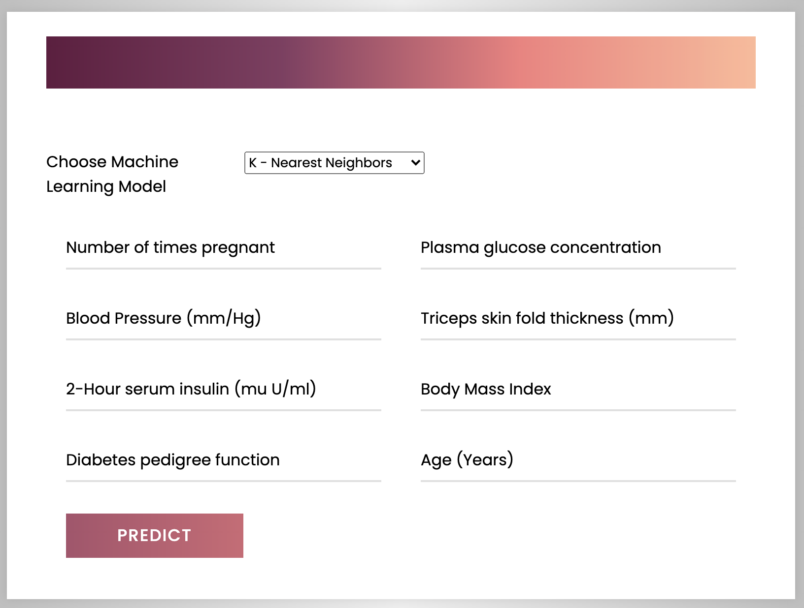
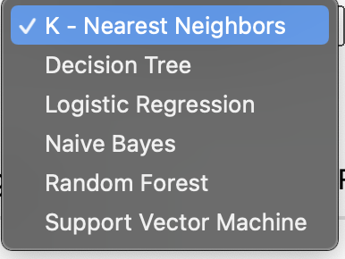

# Diabetes Prediction

I wanted to pursue a project related to medicine which would help the common public. I have used almost all the classification algorithms to predict if a person is diabetic or healthy from the dataset. 

Features:
* Pregnancies	
* Glucose	
* BloodPressure	
* SkinThickness	
* Insulin	
* BMI	
* DiabetesPedigreeFunction	
* Age	
* Outcome

I have created a web application and integrated the front end part of the project and the model by using Flask. 

